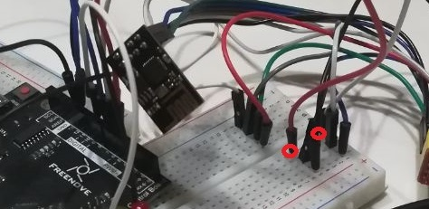

# Arduino ultrasonic alarm

A beta version of my burglar alarm using an Arduino Uno-like microcontroller and a ESP8266 ESP-01 WiFi module. 

# The setting

A HC-SR04 Ultrasonic Module Sensor causes a led to blink (or a passive buzzer to beep) as the measured distance falls in a given range; you will also receive a notification on the local website hosted on the WiFi module.  
In this project we make use of a ESP8266 WiFi module to control the alarm remotely. The WiFi module is powered and programmed by means of a CH340 USB adaptator which has a 3.3V regulator on-board.  .
The initial idea was to entablish a serial communication between the two boards but it turned out to be not so reliable as the simpler wire connection using the GPIO-0 and GPIO-2 pins of the WiFi module. 
The connections between the main board and the sensor and the led are trivial while every usable pin of the ESP8266 is connected to the corresponding entrance of the adaptator.   
The VCC and CH_PD pins are connected together before going to te adaptator. 

GPIO-0 and GPIO-2 are connected to the proper Arduino pins and they remain connected to the adaptator ready for the next upload of code to the WiFi module.

# Uploading the code to the WiFi module

Switch the USB adaptator to PROG mode to upload the code to the ESP8266 ESP-01 via the USB adaptator. 
Insert you WiFi credential into the source code. 
Remember to unplug GOPIO-0 and GOPIO-2 pins from the main board before uploading, otherwise it does not work. 
Two consecutive uploads require the USB adaptator to be disconnected and connected again. The same is true when switching from PROG mode to UART mode and viceversa.

# Uploading the code to the Arduino board

Follow the standard procedure but before this remember to set the desired minimum and maximum of the distance interval to control by assigning *LOWER_BOUND* and *UPPER_BOUND* parameters to the proper values.

# Remote control via device

You can give 4 possible commands to the alarm, all of them are accessible via devices connected to the same local network the WiFi module is using, you just need to know the IP address of the WiFi module (readable from the serial port when connecting the WiFi module in UART mode to the pc), and, of course, the credentials. 
To sent a command go to 'http://IP/COMMAND_NAME', substituting IP with your WiFi module IP and COMMAND_NAME with the name of the command. 
The command names are the ones down here 
 

## on
Switch on the alarm.

## off
Switch off the alarm.

## stop
If the alarm is ringing it deactivates it and starts a pause of 4 seconds. Once the pause is finished the alarm is ready again.

## log
Displays "0" if the alarm is ringing "1023" otherwise.

# Remote control via Telegram

Freenove.py makes use of the *telegraphbot* library to level up the bot. 
Read its [ReadMe](https://github.com/PythonUser-ux/Telegraphbot) to know how to work with it.

Once you run the script (from a device connected to the local network) look for @Freenove_bot on Telegram and send "/start" to start the bot.

Now you are able to send the usual commands from a non local network, but this time there is something additional. 
The "CHECK" command set your alarm to the *surveillance mode* and will notify you by a message when the alarm is ringing. There are two surveillance mode: control_1 and control_2   Control_1 will notify you the first time the alarm goes off and then it exit the control mode leaving the alarm ringing.  Control_2 will notify every time the alarm goes off, and when it does the *stop* command will be called and after the pause is finished the bot is ready to send you another notification the next time the alarm rings without exiting the surveillance mode.   Control_2 mode is the default.   
Commands are disabled during surveillance mode.  Surveillance mode lasts 30 minutes by default but this can be changed.   
If you send "SETTINGS" then you can change the surveillance mode and its duration.
