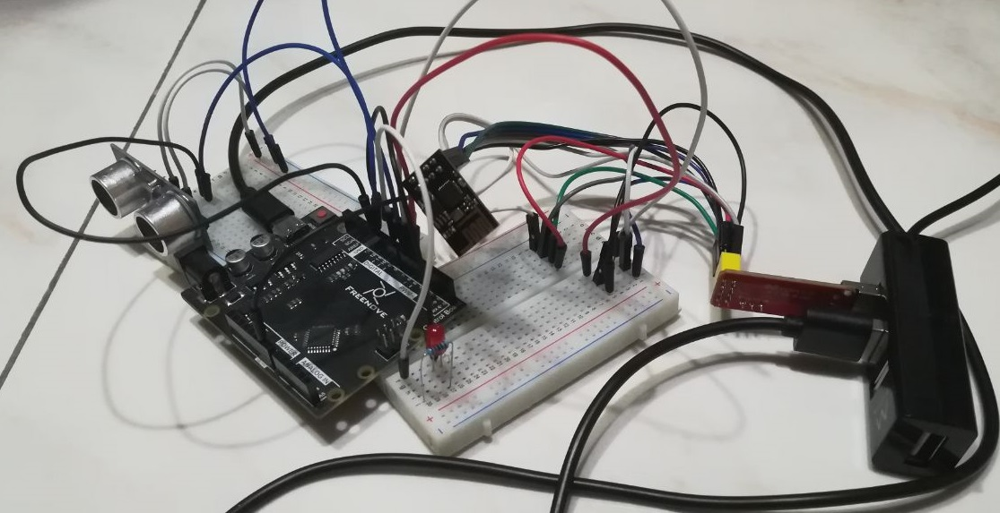
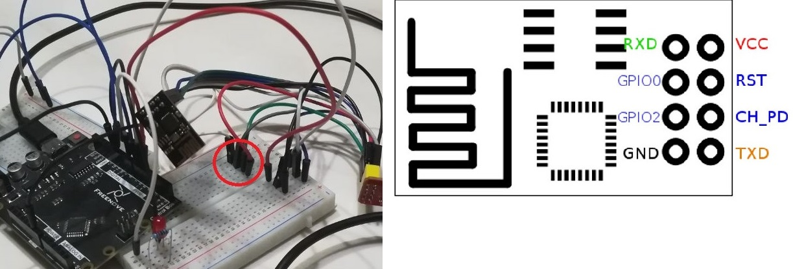
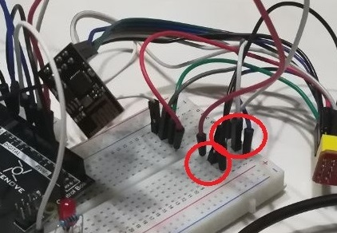

# Arduino-alarm

# The setting

A beta version of my burglar alarm using an Arduino Uno-like microcontroller and a ESP8266 ESP-01 WiFi module. 
A HC-SR04 Ultrasonic Module Sensor causes a led to blink (or a passive buzzer to beep) as the measured distance falls in a given range; you will also receive a notification on the local website hosted on the WiFi module.  
In this project we make use of a ESP8266 WiFi module to control the alarm remotely. The WiFi module is powered and programmed by means of a CH340 USB adaptator which has a 3.3V regulator on-board.  .
The initial idea was to entablish a serial communication between the two boards but it turned out to be not so reliable as the simpler wire connection using the GPIO-0 and GPIO-2 pins of the WiFi module. 
The connections between the main board and the sensor and the led are trivial while every usable pin of the ESP8266 is connected to the corresponding entrance of the adaptator.  
The VCC and CH_PD pins are connected together before going to te adaptator. 

GPIO-0 and GPIO-2 are connected to the proper Arduino pins and they remain connected to the adaptator ready for the next upload of code to the WiFi module.

# Uploading the code of the WiFi module

Switch the USB adaptator to PROG mode to upload the code to the ESP8266 ESP-01 via the USB adaptator. 
Remember to unplug GOPIO-0 and GOPIO-2 pins from the main board before updating, otherwise it does not work.

